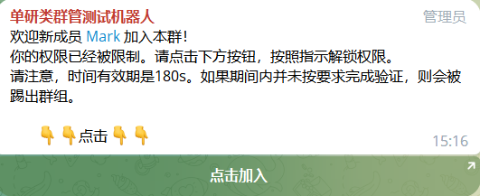
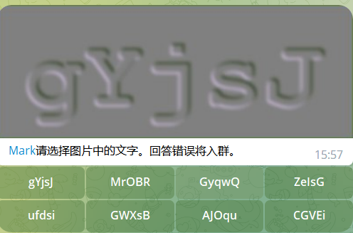

# Telegram 群管机器人

## 简介

自用的群管机器人。会陆续开发完善。

目前支持功能和尚未完工的功能如下：

- [ ] 入群管理功能
  - [x] 图片识别
  - [ ] 管理手动通过/拒绝
- [ ] 关键词识别过滤
  - [ ] 禁言 x 秒
  - [ ] 踢掉
  - [ ] 自动回复（知识库）
- [ ] 开发信息
  - [ ] 消息id/raw内容
  - [ ] 用户信息in nut

 


## 准备工作

本机器人的主要原理是将客户和机器人的对话，转发到一个群内（自用，最好是私有群），并归纳每个客户的消息到一个子版块。
所以，在开工前，你需要：

1. 找 @BotFather 申请一个机器人。
2. 获取机器人的token
3. 建立一个群组（按需设置是否公开）
4. 将自己的机器人，拉入群组。提升权限为管理员。
5. 管理权限切记包含`消息管理`。
6. 通过机器人 @GetTheirIDBot 获取群组的内置ID和管理员用户ID。


## 部署运行

### 1. 修改env

打开`config.example.toml`，将自己机器人的Token管理群组ID和管理员ID补全。
另存`config.example.toml`为`config.toml`

### 2. 构建python venv

```
python3 -m venv venv
. venv/bin/activate
pip install -r requirements.txt
```

### 3. 执行启动

```
python -m Telegram-simple-group-admin
```

**PS:** 正式运营，还是需要类似`PM2`、`supervisor`之类的进程管理工具，配合看门狗来实现不间断运行、自动重启、失效重启等功能。 


## 关于

- 本产品基于Apache协议开源。
- 作者 米哈( @MrMiHa )是一个苦逼程序员，不是煤场奴工，有问题别太理直气壮的跑来下命令。
- 讨论群组是 : https://t.me/DeveloperTeamGroup 欢迎加入后玩耍
- 随意Fork，记得保留`关于`的内容。
- 初版写了2小时。喜欢请打赏。不会部署，群里找我。
- 服务器推荐RackNerd的。实际上，我也确实用这个。够便宜。这款就够：[2核3G--年27刀](https://my.racknerd.com/aff.php?aff=11705&pid=828) 
- 实在搞不定部署，可以群里找大家帮忙部署下。服务器也可以找大家共用： https://t.me/DeveloperTeamGroup 
